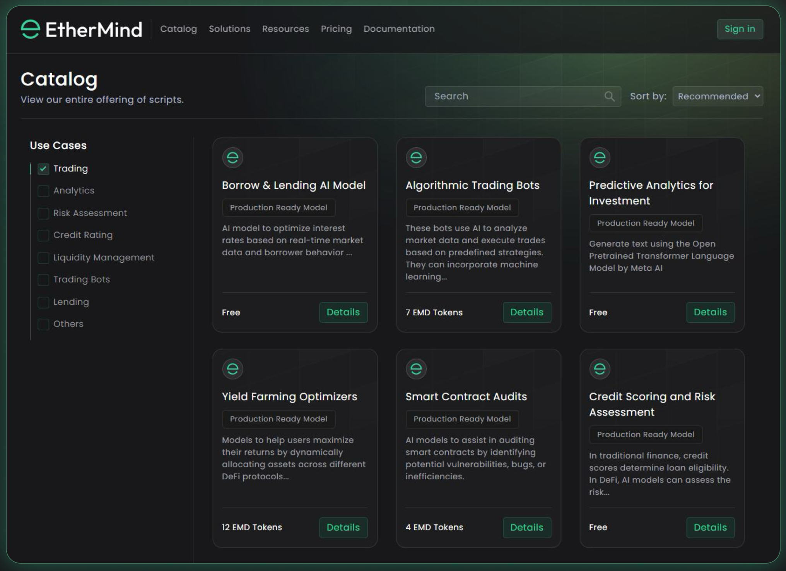

# Chapter 3: Key Features

#### Model and Dataset Listings

EtherMind will feature detailed pages for each AI model and dataset, including descriptions, performance metrics, usage instructions, and pricing. Users can stake tokens on models to vouch for their quality, with rewards distributed based on performance and usage.

#### Advanced Search and Discovery

The platform will include advanced search functionality to help users find models and datasets that meet their specific needs. Community features like rating systems, user reviews, and forums will enhance engagement and feedback.

Snapshot of v1.0

<figure><figcaption></figcaption></figure>

#### Phase 2 : Staking and Incentive Mechanisms

A staking mechanism will allow users to stake tokens on AI models and datasets, vouching for their quality. Rewards will be distributed based on performance and usage, incentivizing the creation and curation of high-quality AI resources.

More details on how users can engage, earn points and more use cases will be shared in at a later stage.&#x20;
